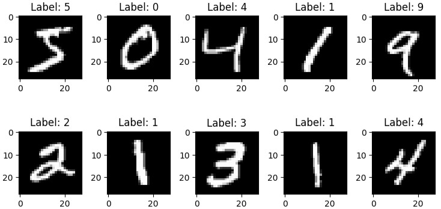

# ✍️ Handwritten Digits Recognition (MNIST)

This project demonstrates how to **classify handwritten digits** using **Deep Learning**. We compare two approaches: a simple **Multilayer Perceptron (MLP)** and a more **advanced Convolutional Neural Network (CNN)** on the **MNIST dataset**.

In this notebook, we explore how **Deep Learning** can be applied to the task of **handwritten digit recognition** using the **MNIST dataset**.

We implement and compare:
- **A Multilayer Perceptron (MLP)**
- **A Convolutional Neural Network (CNN)**

This helps understand the strengths, limitations, and trade-offs of each architecture in image classification tasks.


## 📸 Example Outputs

| Handwritten Digits Recognition Example                                                |
| ------------------------------------------------------------------------------------- |
|  |


## 🛠️ Requirements

Install the necessary libraries:

```bash
pip install keras numpy matplotlib scikit-learn
```


## 📊 MNIST Dataset

We use the [MNIST Dataset](https://keras.io/api/datasets/mnist/) from `keras`.
- Training samples: 60,000 images
- Test samples: 10,000 images
- Image size: 28x28 pixels
- Pixel values: Grayscale (0 to 255)
- Classes: Digits 0 to 9
- Format: Each image is labeled with the digit it represents

| Digit | Train Samples | Test Samples |
| ----- | ------------- | ------------ |
| 0     | 5923          | 980          |
| 1     | 6742          | 1135         |
| 2     | 5958          | 1032         |
| 3     | 6131          | 1010         |
| 4     | 5842          | 982          |
| 5     | 5421          | 892          |
| 6     | 5918          | 958          |
| 7     | 6265          | 1028         |
| 8     | 5851          | 974          |
| 9     | 5949          | 1009         |

The dataset is automatically downloaded using `keras`:
```bash
from keras.datasets import mnist
(train_images, train_labels), (test_images, test_labels) = mnist.load_data()
```


## 🔢 Classification with MLP

### 🔧 Data Preprocessing
- Reshape 28x28 images to flat 784-length vectors
- Normalize pixel values (0-255 → 0-1)
- One-hot encode labels with `to_categorical`

### 🏗️ Model Architecture
Model: Sequential

 Layer:
 - Dense (ReLU, 512 units)
 - Dense (Softmax, 10 classes)

 Output:
 - (None,512)
 - (None,10)

 Parameters:
 - 401,920
 - 5,130 

Total parameters: 407,050

- Optimizer: `Adam`
- Loss: `CategoricalCrossentropy`
- Metrics: `Accuracy`
- Trained for 12 epochs with batch size = 1000

### 📈 Training Results
- Train accuracy: ~98%
- Visualized training loss and accuracy over epochs

### 🔮 Prediction Example
- Predict test set using `model.predict()`
- Use `np.argmax()` to extract predicted digit
- Visualize prediction on sample test images


## 🧠 Classification with CNN

### 🔧 Data Preprocessing
- Reshape input to (28, 28, 1) to retain spatial structure
- Normalize pixel values to [0, 1]
- One-hot encode labels

### 🏗️ Model Architecture
- 3 Convolutional layers with ReLU
- MaxPooling after each Conv layer
- Flatten + Dense (ReLU) + Dense (Softmax)
- Optimizer: `RMSProp`
- Loss: `CategoricalCrossentropy`
- Metric: `Accuracy`

### 📈 Results
- Test accuracy: > 99%
- More robust to distortions and patterns than the MLP
- Slower to train but significantly more accurate


## 📊 Model Performance Metrics
- Each model is evaluated using:
- Accuracy: Proportion of correct predictions
- Loss (Cross-Entropy): Classification loss during training
- Confusion Matrix: Optional, for class-wise analysis
- Training Curves: Accuracy and loss over epochs


## ✅ Conclusion
- MLP Model:
    - ✅ Simpler and faster
    - ❌ Slightly lower accuracy (~98%)
    - 🧪 Suitable for basic applications

- CNN Model:
    - ✅ Higher accuracy (>99%)
    - ✅ Better generalization and feature learning
    - ❌ More complex and computationally intensive


## 📌 Recommendation: 
- Use CNN for real-world handwritten digit recognition due to its superior performance and robustness.